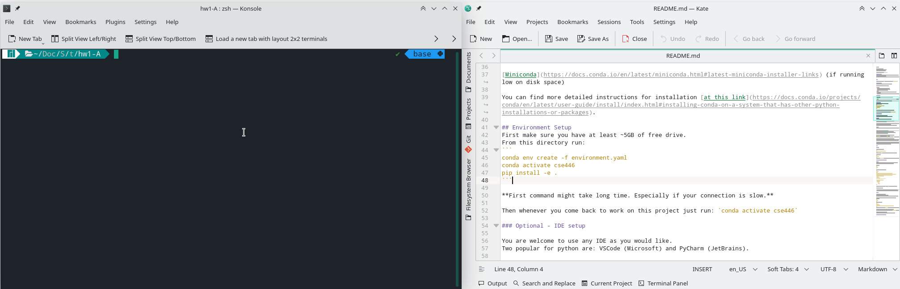
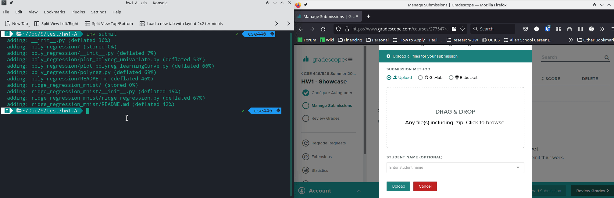

# 446-hw-base

The base for CSE 446 homeworks.
This README will be copied for each homework.

# Reading Markdown files
Before you start doing anything, please make sure you have a proper way of reading markdown files.
You can use any tool you would like for it.
Python IDEs that we recommend for this class (VSCode or PyCharm) come with Markdown readers built-in.


# Setup

**You only need to do setup once**, then for future homeworks you can run `conda activate cse446`.

## Miniconda installation
Before you start working with this repo, you should install Anaconda.

**Before clicking in the link below** read notes below:

* Linux/Mac OS:
  * If using Linux/Mac please install command line version.
  * Make sure that you choose to initialize conda at startup.
    This will lead to fewer headaches in the future
* Windows:
  * If using Windows, we recommend using the Anaconda Terminal, which uses Bash-like syntax. 
* Low storage system
  * If you are low of storage (<10GB; for example attu), then Miniconda (see link below) might be a better option.

### Download links

[Anaconda (default)](https://www.anaconda.com/products/individual#Downloads)

[Miniconda](https://docs.conda.io/en/latest/miniconda.html#latest-miniconda-installer-links) (if running low on disk space)

You can find more detailed instructions for installation [at this link](https://docs.conda.io/projects/conda/en/latest/user-guide/install/index.html#installing-conda-on-a-system-that-has-other-python-installations-or-packages).

## Environment Setup
First make sure you have at least ~5GB of free drive.
Then, from this directory, run:
```
conda env create -f environment.yaml
conda activate cse446
```

*Note*: The first command may take long time, especially if your connection is slow.

**Then, whenever you come back to work on homeworks,** just run: `conda activate cse446`.



### Optional - IDE setup

You are welcome to use any IDE as you would like.
Two popular for python are: VSCode (Microsoft) and PyCharm (JetBrains).

#### PyCharm
PyCharm is tailor made for Python, so the setup should be minimal.

Just make sure you point python interpreter to the right path for the project.
To do so, you should follow [these instructions](https://www.jetbrains.com/help/pycharm/configuring-python-interpreter.html#add-existing-interpreter).

Optional: Please note, that to run linting (optional, see below) you will need to use terminal, and run `inv lint`.
You can try setting up linters through *External Programs* section.
If you succeed please let us know, and we will update this section for future reference :D

#### VSCode
VSCode is general purpose IDE, so you will need to install *Python* and *Pylance* extensions (both by Microsoft).


To setup python interpreter, [follow these instructions](https://code.visualstudio.com/docs/python/environments#_select-and-activate-an-environment)
or first reload VSCode, open a folder with homework downloaded and unzipped.
Click into a python file and in bottom left you should see *Python* with some version.
Click into that and choose one that says "cse446".

Now whenever you open terminal it should say "(cse446)" on the left hand side,
and `which python` (Unix based systems) or `where python` (cmd or powershell terminals) should also output path with `cse446` in it.
Sometimes, it doesn't work with the first terminal after VSCode opens, so `exit` it and reopen it (Ctrl+J).
**NOTE** For further debugging see "Debugging" subsection couple of paragraphs below.

##### **Debugging**
* If `which python` doesn't return path with `cse446` in it, and restarting terminal doesn't work, there might be an issue with settings in VSCode. It may be because of VS Code's setting, namely the inherited environment of the integrated terminal ("Terminal > Integrated: Inherit Env"). Turn it off, and reopen VS Code to see if the issue has been resolved.

Most errors with running code have to do with making sure the cse446 environment is properly activated and being used. We've provided below some debugging tips for commonly seen errors. The discussion board, office hours, and stack overflow are great places to get additional help if you get stuck!

* If you run into an error when setting up the environment, try setting the channel priority differently (see [this post](https://stackoverflow.com/questions/63734508/stuck-at-solving-environment-on-anaconda)).

* If you run into the error `The term inv is not recognized as a cmdlet, function, script, or operable program`:
  * Most likely, the cse446 environment has not been activated properly. If you haven't run `conda activate cse446`, start there. If you have and it still isn't working, and you are on a Windows machine, check which terminal you are running in. You may find that the Anaconda Terminal or the Windows command prompt are better options than powershell (see below for using conda with powershell). 

* If you run into the error `No module named [x]`:
  * This also may be indicative of the environment not being activated/used properly. See the above tip to make sure the environment can be activated.
  * Also confirm that you have selected the correct Python interpreter if you are using VSCode (see the VSCode section above).
  * Confirm that when you run your code, the correct Python version and environment is being used (check `python -V` and `which python`/`where python`). Try using the "run" (play) button if using the `python` command in your terminal is not working.
  * If you are confident that the cse446 environment is being used properly and are still getting a `no module` error, we recommend either of two solutions:
    * Removing the existing cse446 environment using `conda env remove -n cse446` (after deactivating the environment) and reinstalling the environment from scratch.
    * Check the installed packages in the cse446 environment using `conda list`. Uninstall and install specific modules based on the error messages.
  * Some students have had success running `pip install -e .` from the homework directory (in the activated cse446 environment).

* For those using Windows and wanting to use powershell rather than the Anaconda Terminal, or if you are running into the error `conda command is not recognized`, you may find the following posts to be useful:
  * [Activating conda environment from powershell](https://stackoverflow.com/questions/64149680/how-to-activate-conda-environment-from-powershell) 
  * [Conda not being recognized on Windows](https://stackoverflow.com/questions/44597662/)

# Usage

## Submission

When you are done with coding run.
```
inv submit
```
this will generate a `.zip` file that should be uploaded to gradescope for automated grading.

For example running:
```
inv submit
```
will result in `submission_<timestamp>.zip` generated, which should be submitted under corresponding homework coding assignment on gradescope.



Note that if you do get a lot of `NotImplementedError("Your Code Goes Here")` errors when submitting to gradescope you .zip file might be in an improper format which makes autograder unable to detect it. **MAKE SURE TO USE `inv submit` if that happens.


## Testing
In this class we will use unittest framework in python to automatically grade coding problems.
Some of the tests are provided to you, so that you can validate your results.

To run tests:
```
inv test
```

The output should look something like this:
```
> inv test

FFF..
======================================================================
FAIL: test_polyfeatures_fives (public.poly_regression.test_poly_regression.TestPolyReg)
----------------------------------------------------------------------
Traceback (most recent call last):
  File ...
AssertionError: 
Arrays are not almost equal to 6 decimals

(shapes (1,), (20, 1) mismatch)
 x: array([1.])
 y: array([[5.],
       [5.],
       [5.],...
```

You can see that in the top there are 3 `F`'s and 2 `.`'s. `F`'s correspond to failed tests and `.` correspond to correct tests.

There are few things to note:

- Not all tests are equal. Some are worth more points. This will not be displayed when you run `inv test`.
- We **do not** provide you with all tests. There are many that hidden. Even if you pass all *public* tests you may still fail some *hidden* ones. We recommend submitting your code to Gradescope early and often so you can check the autograder score before the deadline, in case you would like to resubmit.

### Testing specific problem
Unfortunately the `unittest` framework doesn't allow for testing specific file.
However, you can run tests against specific problem, using the problem's directory name.
To do so run:
```
inv test --problem <problem-name>
```
For example:
```
> inv test --problem poly_regression

test_fit_and_predict_cubic (test_poly_regression.TestPolyReg) ... ok
test_fit_and_predict_straight_line (test_poly_regression.TestPolyReg) ... ok
test_fit_cubic (test_poly_regression.TestPolyReg) ... ok
test_fit_hard (test_poly_regression.TestPolyReg) ... ok
test_fit_linear (test_poly_regression.TestPolyReg) ... ok
test_fit_straight_line (test_poly_regression.TestPolyReg) ... ok
test_mean_squared_error (test_poly_regression.TestPolyReg) ... ok
test_polyfeatures_fives (test_poly_regression.TestPolyReg) ... ok
test_polyfeatures_ones (test_poly_regression.TestPolyReg) ... ok
test_polyfeatures_twos (test_poly_regression.TestPolyReg) ... ok

----------------------------------------------------------------------
Ran 10 tests in 0.197s

OK
```

## Linting

Linting is **not required** for this class.
However, it can be helpful to keep your code linted, especially if this is your first time learning python or if you never had a formal introduction.

For this we provided you with a simple script to track issues & possibly fix your code.
To run linter:
```
inv lint
```
which will generate output
```
> inv lint
flake8 homeworks
homeworks/hw1/poly_regression/polyreg.py:103:5: E303 too many blank lines (4)
```
You can see that issue points to file (`polyreg.py`), line (105) and column (3) as well as the issue "too many blank lines".

Note that we are using 4 linters (flake8, isort, black, mypy; in that order).
If you have issues that are pointed out by isort or black you can run `inv lint --apply` to automatically apply fixes.

Again, linting is **not required** for this class.
If you don't want to lint your code, or prefer some other linting setup that's ok!
